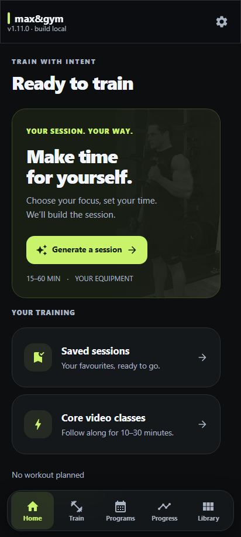
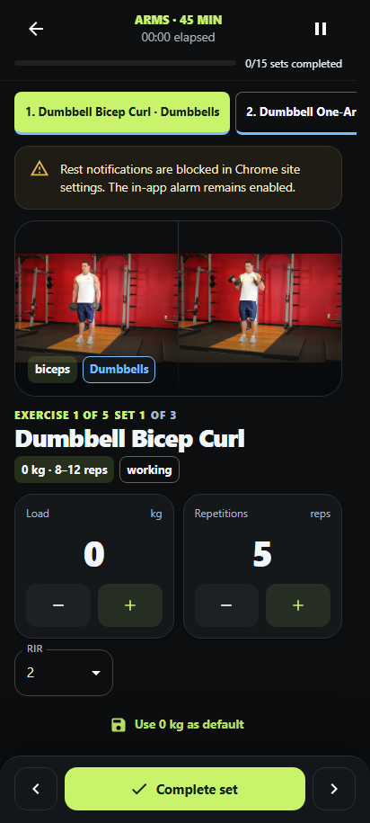
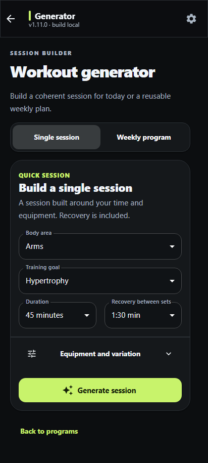
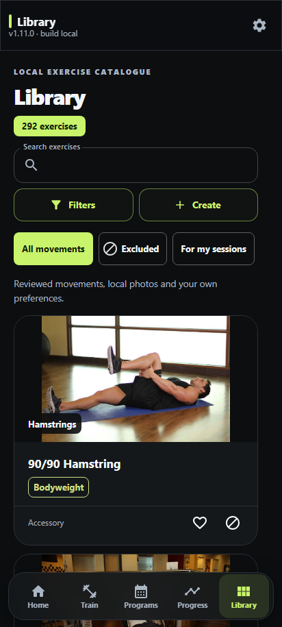

# v1.11.0 — Graphite and citron interface

## Outcome and scope

Owner request: review the interface with full creative latitude. Task 02 extension, UI-010–UI-020. The redesign makes quick generation a primary Home/Train action, brings set entry immediately below the current exercise, and applies a consistent graphite/citron system across the app.

The prior diagnostic review identified separate generator/duration/transaction issues. Those engine changes are not part of this visual release. The Settings backup entry is corrected as part of navigation consolidation: it opens the existing complete `.maxgym` backup instead of the legacy JSON export.

## Audit and plan

- Read permanent contract, Task 02, design system, blueprints, copy deck, flows, component catalogue, donor rules and ADR 0002/0003.
- Previous UI: teal surfaces, many similarly weighted cards, set input below several guidance panels, nested card buttons in the library and oversized desktop navigation items.
- Plan: shared theme and shell first, followed by Home/Train, generator, library and active-session hierarchy; then phone/desktop screenshots and existing reliability checks.
- All changes use existing Material UI components, bundled photographs and local/system fonts. No external visual donor code or new asset licence is introduced.
- Existing unrelated dirty files and the diagnostic report are excluded from the implementation commit.

## Implemented

- Graphite canvas `#0C0E10`, surfaces `#15181B`, citron accent `#C8F36B`; quieter card backgrounds and larger editorial headings.
- Consistent cards, form controls, action buttons and 48px interactive targets. Passive equipment tags retain their own labelled colour system.
- Floating mobile navigation, safe-area spacing, active-route semantics and compact desktop navigation. The active-workout dock remains above navigation.
- Home and Train have a photo-led quick-generation entry. Home retains priority for an active session and its confirmed stop flow. Saved sessions are directly available.
- The generator groups focus/goal above side-by-side duration and recovery fields. Redundant choice-summary chips are removed; the estimate and generated exercise preview remain available.
- Photo-led library cards separate the main open action from favourite/exclusion actions, eliminating nested buttons. Existing status filters are also exposed as named quick filters.
- Load and repetitions appear side by side directly below the current photo/name. Plus/minus controls retain their step sizes and blank/numeric input behavior. Advice, ratings, technique and alternative actions remain available below.
- Larger rest digits and common fixed-action styling. Timer calculations, pause/resume and workout persistence are unchanged.
- Phone dialogs open as bottom sheets; explicitly full-screen dialogs retain their full-screen layout.
- Supporting Program, Settings, onboarding and utility screens inherit the same system; fixed old teal/surface styles in affected screens are aligned.
- The static contrast audit now reads the actual theme palette and checks primary action text rather than comparing only old hardcoded colour values.

## Screenshots

Anonymous synthetic profile, 412 × 915. Browser notification permission is granted in the fixture; no phone permission or personal data was changed.

| Home | Workout |
|---|---|
|  |  |

| Generator | Library |
|---|---|
|  |  |

Additional 360px, rest and 1440px desktop screenshots are generated by `tests/design.spec.ts` in the Playwright artifact. Phone and desktop captures were visually inspected. A first screenshot pass exposed oversized desktop navigation and a verbose generator layout; both were adjusted. Initial screenshot navigation synchronization and the Backup selector were corrected to wait for each destination's exact heading and actual label.

## Verification

Commands below use the configured Node 24 executable as `node`.

- `node scripts/run-tests.mjs`: 229 tests / 55 files passed.
- `node scripts/run-tests.mjs src/db`: 7 migration tests passed.
- `node node_modules/typescript/bin/tsc --noEmit`: passed.
- ESLint on changed modern UI modules and `tests/design.spec.ts`: passed, zero warnings; full configured lint runs in CI.
- `node scripts/build.mjs` and `node scripts/build-android.mjs`: passed; Pages and Android subpath smoke passed.
- `PLAYWRIGHT_BASE_URL=http://127.0.0.1:4181/max-and-gym/ node node_modules/@playwright/test/cli.js test`: all 30 mobile browser journeys passed.
- After final generator/desktop layout adjustments: the 4 affected design/generator journeys passed at both phone widths. The final notification-enabled screenshot fixture passed both widths again.
- New cross-screen test verifies the complete-backup destination, library button semantics, aligned numeric controls, entering 5 repetitions, completing a set and rest controls; it captures Home, Train, generator, Programs, Library, Progress, Settings, workout, rest and desktop.
- Project, architecture, dependency, network, Android release, asset, exercise asset, language, accessibility and performance audits passed. Existing legacy architecture warnings remain.
- Minimum checked primary text contrast: 16.41:1; secondary text: 8.56:1; primary action: 13.28:1. Focus and reduced-motion provisions remain. These automated checks are a baseline, not a claim of exhaustive screen-reader certification.
- Entry bundle about 647 KB, largest non-data route 309 KB; existing budgets pass. No new dependency or runtime origin.
- `git diff --check`: passed.
- Clean installation, full licence audit and native APK compilation are verified by the existing PR workflows; the local dependency installation uses a historical pnpm layout and no local Android SDK is configured.

## Identity and compatibility

- Application version: 1.11.0.
- Database schema: 8; export: 2; exercise/program seeds and generator v9 unchanged.
- Cache identifier: 9, unchanged; content-hashed web resources rebuild normally. No service-worker activation-policy change.
- No data transformation, import, reset, program edit, automatic load progression or new persistence field.
- The backup entry opens an already implemented page. Historical import routes remain reachable for compatibility.
- Revert the visual/navigation commit to roll back; no data rollback is required. A released rollback must use a newer Android versionCode.

## Release boundary

This PR provides the reviewable UI and screenshots. Signed APK-in-ZIP publication remains the normal approved master-merge workflow. Other findings from the September 5 diagnostic report remain separate work. No physical Pixel install/background test is claimed by these browser screenshots.
